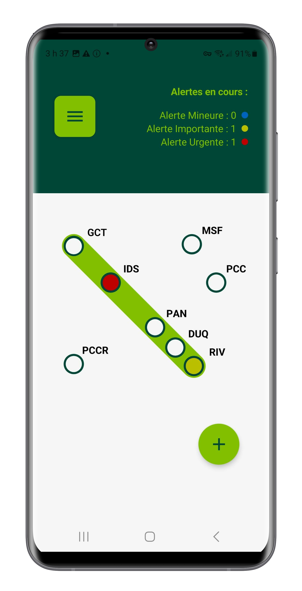
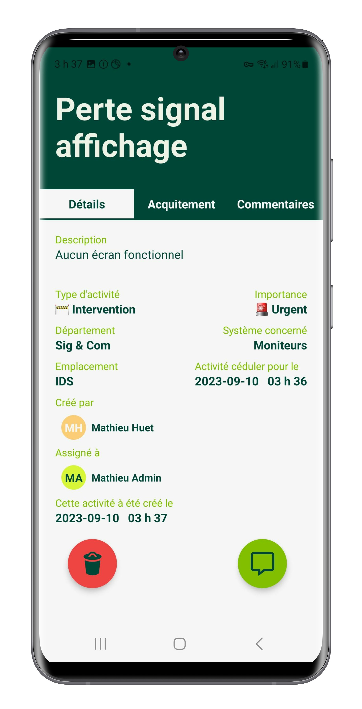
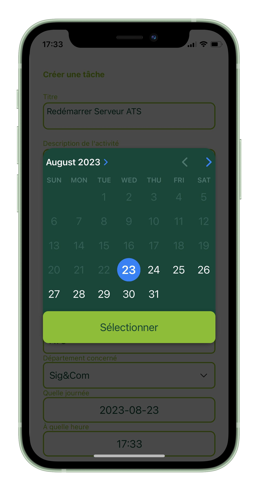
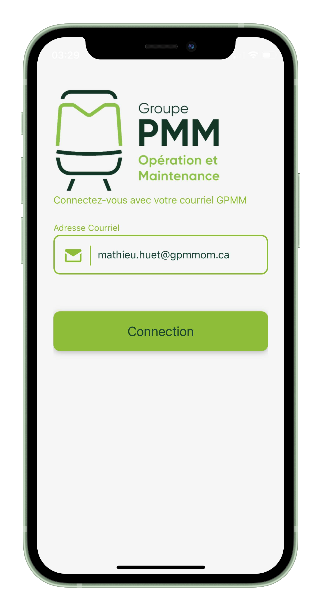

# GPMM_Alertes Create User

This app is intended for GPMM O&M, more specifically the people who maintain and operate de REM (Réseau Express Métropolitain). The app feature all the major area of the current REM, it let you create alerts and attribute them to specific employee if needed, you can monitor all alerts on the REM network. You can plan alerts ahead of time for recurring jobs, you can also assign them to specific teams, equipment, zone and location.

This app is for iOS and Android

This app is not used by GPMM O&M. They prefer to outsource their software and they already did, using Maximo from IBM as a event manager.

## Getting Started

To install the required dependencies, you're gonna run `npm install` at the root of this repository.

afterward your run `npx expo install` and then to run the app you enter the command `npx expo start`

This app can't work properly if you're not running [the GPMM_Alertes_server](https://github.com/mathieuhuet/GPMM_Alertes_server), don't forget to point the App toward [the GPMM_Alertes_server](https://github.com/mathieuhuet/GPMM_Alertes_server) IP and port.

You need to create a `secret.ts` file at the root of the project that export these variables : `GPMM_USER_API` `GPMM_ACTIVITY_API` `GPMM_SITE_API`

## Tech Stack

The front-end framework is **React Native** and wouldn't been possible without **Expo**

The back-end server is **Express.JS**

The database is **Mongo DB**

## Screenshots

